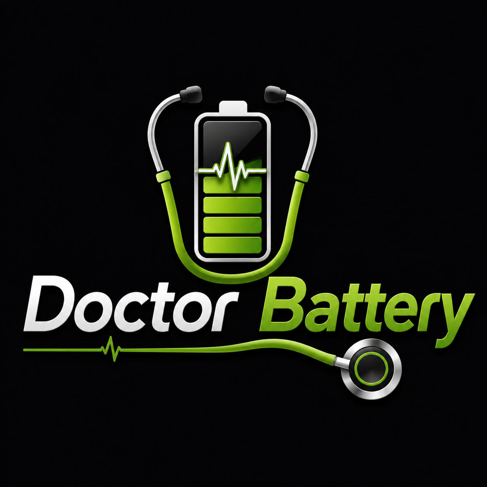

  

<h1 align="center">Doctor Battery</h1>

  Battery diagnostics plugin for KOReader

  
  
  

---

Doctor Battery is a battery diagnostics plugin for KOReader that provides detailed information about your device's battery health, charging status and overall condition.

Instead of showing only the battery percentage, Doctor Battery gathers additional battery information exposed by the operating system and presents it through a simple, intuitive and easy-to-read interface.

The plugin helps users monitor battery health, charging behavior and detect potential issues over time.

---

## Features

- 🔋 Battery percentage
- ❤️ Battery health estimation
- ⚡ Charging / discharging status
- 🔄 Battery cycle count (when supported)
- 🌡️ Battery temperature (when available)
- 🔌 Charging source detection (USB / AC / Wireless, when supported)
- 📊 Detailed battery information
- 🩺 Automatic battery diagnostics
- ⚠️ Detection of possible battery issues
- 🌍 Multi-language support

---

## Installation

1. Download the latest release.
2. Extract the archive.
3. Copy the `DoctorBattery.koplugin` folder into the `plugins` directory of KOReader.
4. Restart KOReader.

---

## Language

Doctor Battery automatically uses the language currently configured in KOReader.

Currently available translations:

- 🇬🇧 English
- 🇮🇹 Italian
- 🇫🇷 French
- 🇩🇪 German
- 🇪🇸 Spanish

If your language is not yet available, contributions are welcome.

---

## Emoji Support

Doctor Battery uses emoji icons to improve readability.

Some devices or fonts may not display emojis correctly. If you see missing symbols or empty squares, install an emoji-compatible font.

Doctor Battery has been tested with **Noto Color Emoji**, which is the recommended font for displaying all icons correctly.

For installation instructions, follow the guide from the KOAssistant project:

https://github.com/zeeyado/koassistant.koplugin?tab=readme-ov-file#emoji-font-setup

---

## Compatibility

Doctor Battery is designed for KOReader.

Some battery information depends on the operating system and device hardware. Therefore, certain values may not be available on every e-reader.

---

## Contributing

Bug reports, feature requests and pull requests are always welcome.

If your device exposes battery information that is not currently supported, feel free to open an issue.

---

## License

Released under the MIT License.
